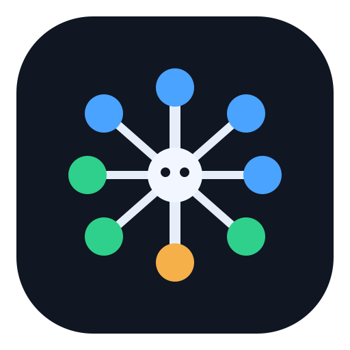
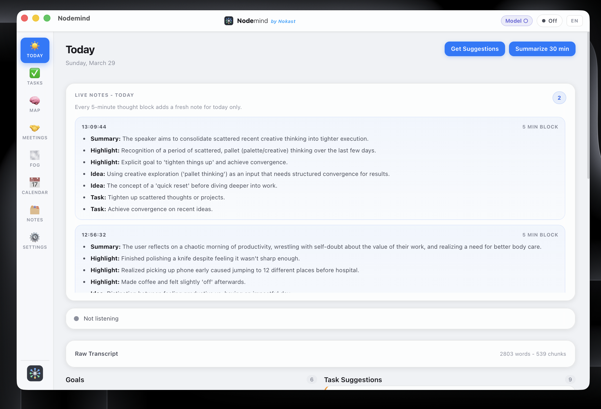

<p align="center">
  
</p>

<h1 align="center">Nodemind by Nokast</h1>

<p align="center">
  A voice-first, local-only personal assistant for macOS.<br />
  Think out loud in Hindi or English, and Nodemind turns that stream into tasks, meetings, summaries, suggestions, and a living mental map.
</p>

<p align="center">
  <strong>Fully local</strong> • <strong>macOS native</strong> • <strong>Open source</strong> • <strong>Built with Tauri, Rust, React, Whisper, and Ollama</strong>
</p>

<p align="center">
	<a href="https://github.com/abhishek085/Nodemind/releases/download/v0.1.0/Nodemind_0.1.0_aarch64.dmg">
		
	</a>
</p>

<p align="center">
	
</p>

## About

Nodemind is designed for people who process ideas by speaking.

Instead of forcing you into a chat box or manual note-taking flow, it listens to your spoken thoughts, detects commands, extracts structure, and surfaces what matters in a desktop dashboard.

The app is built around a simple idea: your voice can be both input and context.

With Nodemind, you can:

- speak naturally in Hindi, English, or mixed speech
- create tasks and goals with voice commands
- run meeting capture locally and generate notes afterward
- review suggestions, summaries, and focus directions
- build a mental map of projects, people, topics, and recurring fog patterns

No cloud STT or hosted LLM is required in the core workflow. Your speech, transcripts, and structured context stay on your machine.

- Screenshot:

	

## Install on macOS

Nodemind is currently distributed as a native macOS app bundle.

Before launching the app, make sure your machine already has:

- Ollama installed locally
- a capable local model available in Ollama
- a decent 8B model running for better performance

<p align="center">
	<a href="https://github.com/abhishek085/Nodemind/releases/download/v0.1.0/Nodemind_0.1.0_aarch64.dmg">
		
	</a>
</p>

1. Download the installer: [Nodemind_0.1.0_aarch64.dmg](https://github.com/abhishek085/Nodemind/releases/download/v0.1.0/Nodemind_0.1.0_aarch64.dmg)
2. Open the `.dmg` and move the app into your `Applications` folder.
3. Before launching the app for the first time, run this command in Terminal because the app is currently unsigned:

```bash
sudo xattr -cr /Applications/zac_personal_assistant.app
```

4. Open Nodemind from `Applications`.

## What The App Does

### Voice-first capture

- Continuously listens when the mic is on
- Transcribes speech locally with Whisper-style speech recognition
- Supports Hindi, English, and mixed speech while normalizing output for downstream processing

### Direct voice commands

- Detects instruction-like speech and routes it for structured action
- Can create tasks, reminders, goals, focus blocks, and meeting actions
- Supports natural commands such as starting or ending a meeting, setting a goal, or creating a task

### Ambient thought processing

- Treats non-command speech as ambient thinking
- Sends transcript chunks to a local LLM for annotation
- Extracts tasks, topics, and fog signals in the background

### Today dashboard

- Shows live transcript activity
- Surfaces saved suggestions and summaries
- Displays goals, activity, and recent structured notes from your day

### Meetings and people memory

- Start a meeting from voice or UI
- Capture meeting context over time
- Generate summaries, decisions, and action items locally
- Group meetings by person for later review

### Mental map

- Builds a graph of goals, tasks, topics, people, projects, and fog patterns
- Helps you see relationships between active work and recurring thought loops
- Lets you refresh and inspect the current state of your mental model

### Fog detection

- Tracks signals like overthinking, looping, uncertainty, and context friction
- Turns subjective mental clutter into something reviewable
- Helps convert vague cognitive drag into concrete action

### Calendar and focus support

- Surfaces focus-oriented suggestions
- Supports calendar-style review for sessions and planning flows
- Gives you a structured review layer beyond raw transcripts

### Local persistence

- Stores transcripts, tasks, goals, meetings, and graph state locally
- Uses SQLite on-device for persistence
- Keeps your voice-derived data available without relying on external services

## How It Works

Nodemind uses a local, offline-first pipeline:

1. **Audio capture**
	The Rust backend captures microphone audio when listening is enabled.

2. **Speech to text**
	Audio chunks are transcribed locally using Whisper-style STT.

3. **Command detection**
	If speech sounds like a direct command, it is parsed immediately into a structured intent.

4. **Ambient annotation**
	If speech is not a command, it is treated as ambient thought and analyzed for tasks, topics, and fog signals.

5. **Local reasoning**
	Ollama is used locally for command parsing, annotation, suggestions, summaries, and meeting notes.

6. **State updates**
	Extracted entities are written into local storage and used to update tasks, goals, meetings, and the mental map.

7. **UI review**
	Results appear across the Today, Tasks, Meetings, Fog, Calendar, Notes, and Mental Map views.

## Why It Exists

Most productivity tools assume your thinking is already clean, typed, and intentional.

Nodemind is built for the earlier stage, when ideas are still messy, spoken, contextual, and evolving. It helps turn that unstructured stream into an actionable system without forcing you to leave your natural thought process.

## Privacy

- no cloud speech-to-text in the core app flow
- no hosted LLM dependency in the core app flow
- no remote telemetry pipeline built into the product workflow
- your transcripts, meeting notes, suggestions, and graph data remain local to your machine

## Tech Stack

- Desktop shell: Tauri 2 with Rust
- Frontend: React 19, TypeScript, Vite
- Audio capture: `cpal`
- Local STT: `whisper-rs` with macOS CoreML assets
- Local reasoning: Ollama
- Persistence: SQLite via `rusqlite`

## Project Structure

- [src](src) — React UI, hooks, types, and view components
- [src-tauri/src](src-tauri/src) — Rust backend commands, DB layer, prompts, and pipeline logic
- [src-tauri/resources](src-tauri/resources) — bundled prompts and local model assets
- [Technical_design.md](Technical_design.md) — architecture direction and product design intent
- [HowItWorks.md](HowItWorks.md) — current flow notes for speech, command parsing, and local reasoning

## Development

### Prerequisites

- macOS
- Apple Silicon recommended
- Node.js 18+
- Rust stable toolchain
- Xcode Command Line Tools
- CMake
- Ollama installed locally
- Whisper model assets installed locally in `src-tauri/resources/models`

### Local model setup

The repo intentionally does not commit the Whisper binary weights or compiled CoreML encoder assets. They are large, machine-specific, and should stay local.

The app currently looks for these files at runtime:

- `src-tauri/resources/models/ggml-small.bin`
- `src-tauri/resources/models/ggml-small-encoder.mlmodelc`

`ggml-small.bin` is required. The CoreML bundle is optional but recommended on Apple Silicon for faster transcription. If the CoreML encoder is missing or fails to initialize, the app falls back to CPU transcription.

Install the local dependencies first:

```bash
xcode-select --install
brew install cmake ollama
ollama pull qwen3.5:9b
```

Then fetch the Whisper weights and build the CoreML encoder with `whisper.cpp`:

```bash
git clone https://github.com/ggerganov/whisper.cpp /tmp/whisper.cpp
cd /tmp/whisper.cpp
./models/download-ggml-model.sh small
./models/generate-coreml-model.sh small
```

Copy the generated assets into this repo:

```bash
mkdir -p src-tauri/resources/models
cp /tmp/whisper.cpp/models/ggml-small.bin src-tauri/resources/models/
cp -R /tmp/whisper.cpp/models/ggml-small-encoder.mlmodelc src-tauri/resources/models/
```

Your local folder should end up like this:

```text
src-tauri/resources/models/
	ggml-small.bin
	ggml-small-encoder.mlmodelc/
		metadata.json
		model.mil
		coremldata.bin
		analytics/
		weights/
```

These model assets are ignored by Git, so they will stay on your machine and will not be pushed with normal commits.

### Run in development

```bash
npm install
npm run tauri dev
```

If transcription fails on first launch, verify that:

- `ollama serve` is running or can be started from your shell
- `ollama list` shows `qwen3.5:9b`
- `src-tauri/resources/models/ggml-small.bin` exists
- `src-tauri/resources/models/ggml-small-encoder.mlmodelc` exists for CoreML acceleration

### Build a production app

```bash
npm run tauri build
```

## Current Status

This is an active open-source project and still evolving.

The current app already includes:

- native macOS desktop packaging
- local microphone capture and live transcription
- direct command parsing
- local LLM-powered chunk annotation and summaries
- views for Today, Tasks, Meetings, Fog, Calendar, Notes, and Mental Map

## Contributing

Contributions are welcome.

1. Read [Technical_design.md](Technical_design.md) before making architectural changes.
2. Keep PRs small and focused.
3. Preserve the local-only design unless a change explicitly requires otherwise.
4. Test changes locally before submitting.

## License

See [LICENSE](LICENSE).

Original source code in this repository is MIT-licensed unless noted otherwise for third-party components.
